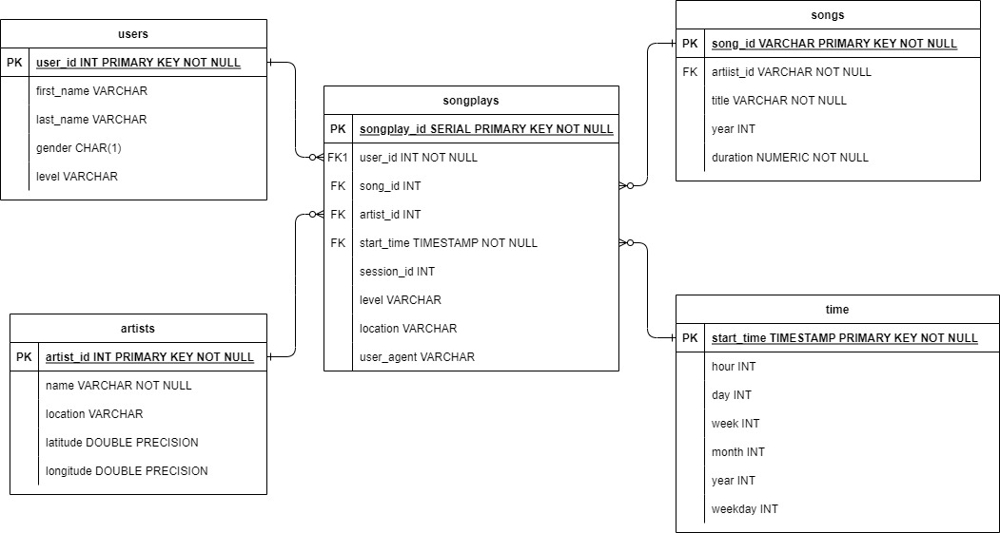

# Purpose
- A startup called **Sparkify** wants to analyze the data they've been collecting on songs and user activity on their new music streaming app. In pursuit of this the data engineers are tasked with creating a database schema called **sparkifydb** andan ETL pipeline to ingest user activity logs data and songs data, both available in JSON format.
- The **sparkifydb** consists of dimensions *songs*, *users*, *artists*, *users* and facts *songplays*
- The analytics team is particularly interested in understanding what songs users are listening to.

## How to run the scripts
- Write **CREATE** statments in sql_queries.py to create each table
- Write **DROP** statements in sql_queries.py to drop each table if it exists.
- Write **INSERT** statements in sql_queries.py to insert data in to tables.
- Write **SONG SELECT** statement in sql_queries.py to select song_id and artist_id.
- Run **create_tables.py** to create your database and tables.
- Run **etl.py** script which in turn connects to the Sparkify (sparkifydb) database, extracts and processes the log_data and song_data, and loads data into the five tables.

## Deatils of the files in the reposiotry
- **create_tables.py**
    - The script connects to the Sparkify database, drops any tables if they exist, and creates the tables.
- **sql_queries.py**
    - specify all columns for each of the five tables with the right data types and conditions i.e. CRUD statements   
- **test.ipynb**
    - displays the first few rows of each table to let you check your database via IPython SQL Magic extension
- **etl.ipynb**
    - reads and processes a single file from song_data and log_data and loads the data into five tables. 
- **etl.py**
    reads and processes files from song_data and log_data and loads them into your tables.
- **README.md** 
    - provides discussion on your project.
- **project-1-data-model.jpg**
    - star schema diagram of the sparkify database
- **run_py.ipynb**
    - contains run commands to execute create_tables.py & etl.py
    
## State and justify your database schema design and ETL pipeline
- The database schema is designed as a star schema where in users, songs, artists, time are dimensions an songplays is a fact.
- If the analytics team wants to analyse the songs/logs data w.r.t which user or song or artist or at what time the activity was done, the appropriate facts can be extracted from songplays table with the dimensions providing the relevant context.

- Below diagram illustrates the data model diagram

()
    